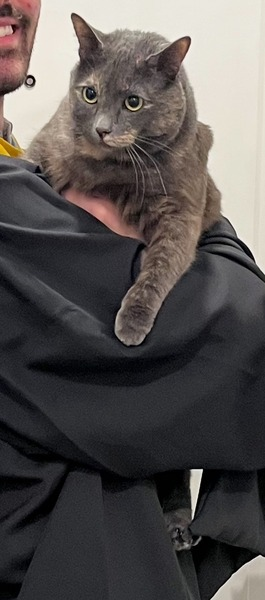

I'm a PhD student at the University of North Carolina at Chapel Hill, working in the Computer Science department. My advisors are [Don Porter](https://www.cs.unc.edu/~porter/) and [Andrew Kwong](https://andrewkwong.org). If you'd like to reach out, email is the best way to reach me (over on the left sidebar).

My research interests are in security and computer science education (CSEd). In security, I enjoy making things "break"--input form edge cases, hardware exploits, etc. You name it, and I've probably tried poking a hole in it. In CSEd, I'm interested in building new tools to give programming students immediate feedback, as well as coming up with techniques to challenge students' understanding of programming concepts in a post-generative AI world.

Outside of work, I enjoy horror movies, listening to music, and baking.

I have one cat named Lexie. Obligatory cat photo included, of course. 

{: height="400"}

