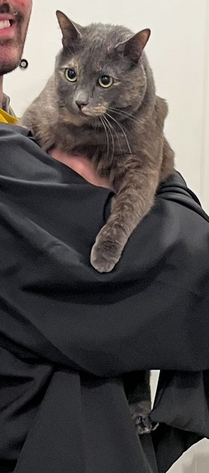

Hi there! I'm a fourth-year PhD student at the University of North Carolina at Chapel Hill, working in the Computer Science department. My advisors are [Don Porter](https://www.cs.unc.edu/~porter/) and [Andrew Kwong](https://andrewkwong.org). If you'd like to reach out, email is the best way to reach me (over on the left sidebar).

My research interests are in security and computer science education (CSEd). In security, I enjoy making things "break"--input form edge cases, hardware exploits, etc. You name it, and I've probably tried poking a hole in it. In CSEd, I'm interested in designing engaging, active lectures in theoretical concepts, as well as coming up with techniques to challenge students' understanding of programming concepts in a post-generative AI world.

Outside of work, I enjoy horror movies, listening to music, and learning useless trivia facts. (Did you know the safety pin was invented to [pay off a debt to a friend](https://en.wikipedia.org/wiki/Safety_pin#Invention_of_the_safety_pin)?)

I have one cat named Lexie. Obligatory cat photo included, of course. 

{: height="400"}

### Service

[IEEE 2026 Symposium on Security and Privacy](https://sp2026.ieee-security.org/) - Artifact Evaluation Committee

#### Analytics Disclaimer

I use [Google Analytics](https://policies.google.com/technologies/partner-sites?client_theme=dark) to see where/when my page gets more traffic; I don't intend to sell or otherwise share this data.

